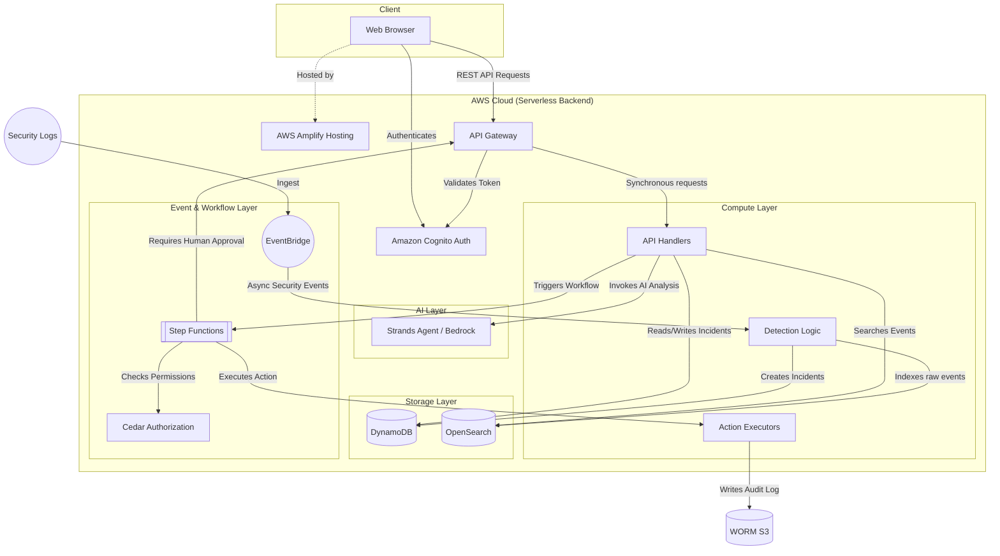

# SentinelFlow System Architecture

## Objective
To design a secure, scalable, and event-driven serverless backend on AWS that ingests security events, correlates them into incidents, leverages AI for analysis, and uses human-in-the-loop workflows to execute authorized responses.

## Architecture Diagram

## System Components

### 1. Synchronous Requests
- **Browser -> API Gateway -> LambdaAPI:** For UI operations like fetching incidents, viewing the attack story, and manual interactions.
- **Authentication:** All requests via API Gateway use Cognito Authorizers to ensure the user is authenticated.

### 2. Asynchronous Events
- **EventBridge -> LambdaDetect:** New security events are ingested asynchronously via EventBridge, allowing decoupled detection logic (owned by Member 2) to analyze them, index them in OpenSearch, and create Incidents in DynamoDB if a threat is detected.

### 3. Authentication & Authorization
- **Authentication (Cognito):** Manages user identities and basic roles (ADMIN, ANALYST, VIEWER).
- **Authorization (Cedar):** Handles fine-grained access control before any sensitive response action is taken (e.g., verifying if a specific user role is permitted to block an IP address).

### 4. Data Storage
- **DynamoDB:** The primary transactional database (source of truth) for Incidents and Recommendations.
- **OpenSearch:** Optimized for fast, full-text search and filtering of raw security events.
- **S3 (Object Lock):** WORM-compliant storage serving as the immutable source of truth for Audit Logs.

### 5. AI Processing
- **Strands Agents SDK / Amazon Bedrock:** Invoked by API Lambdas when an analyst requests an investigation. The agent queries OpenSearch for evidence and returns structured attack stories and response recommendations.

### 6. Response Workflow
- **Step Functions:** Orchestrates the response. When an AI recommends an action, it enters a Step Function workflow. The workflow checks Cedar for authorization, waits for human approval via an API callback, and only then triggers the Lambda executor to perform the action and write an audit log.
